<!-- Main -->

<!-- One -->
<section id="one">
	

		<header class="major">
			<h2>Below you will find a sample of my artwork</h2>
		</header>
		
        

	

</section>

<!-- Two -->
<section id="two" class="spotlights">

  <section>
		<a href="gallery.html" class="image">
			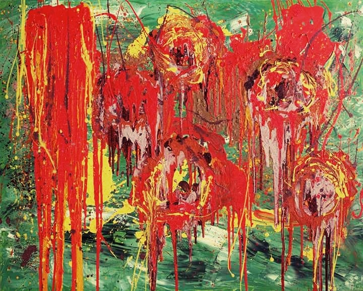
		</a>
		

			

				<header class="major">
					<h3>Red Flowers</h3>
				</header>
				
Oil on canvas

        
48 x 60"

				<!-- <ul class="actions">
					<li><a href="gallery.html" class="button">Learn more</a></li>
				</ul> -->
			

		

	</section>

  <section>
		<a href="gallery.html" class="image">
			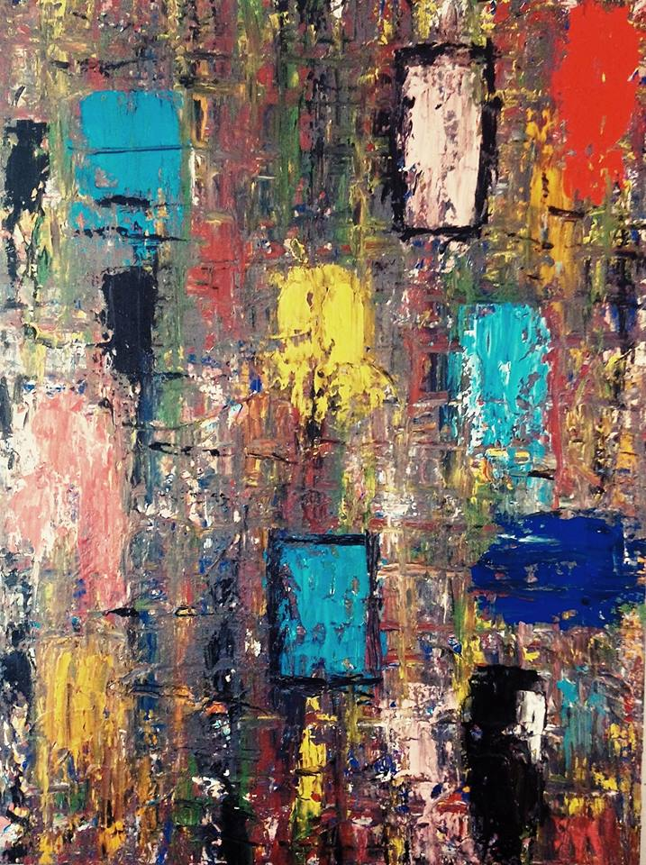
		</a>
		

			

				<header class="major">
					<h3>Blue in Yellow</h3>
				</header>
        
Oil on canvas

        
48 x 30"

				<!-- <ul class="actions">
					<li><a href="gallery.html" class="button">Learn more</a></li>
				</ul> -->
			

		

	</section>

  <section>
		<a href="gallery.html" class="image">
			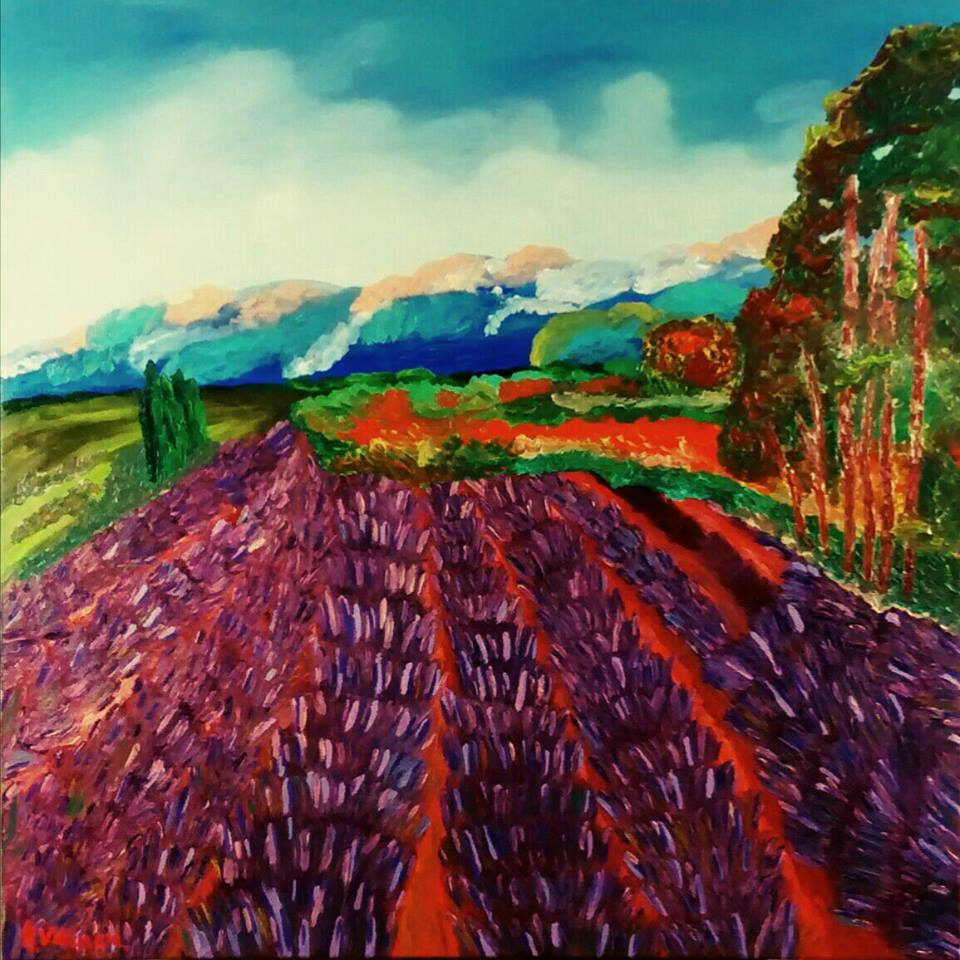
		</a>
		

			

				<header class="major">
					<h3>Endearing Field</h3>
				</header>
				
Oil on canvas

        
36 x 36"

				<!-- <ul class="actions">
					<li><a href="gallery.html" class="button">Learn more</a></li>
				</ul> -->
			

		

	</section>

  <section>
		<a href="gallery.html" class="image">
			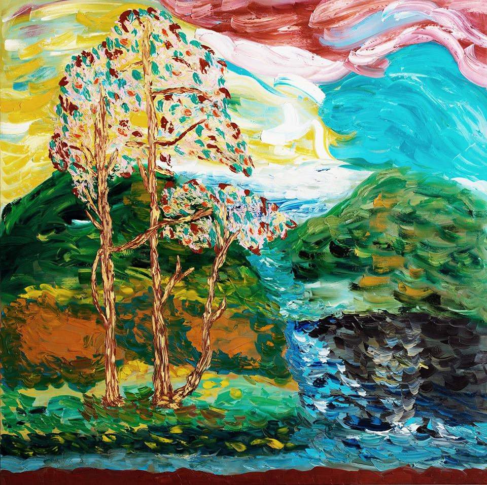
		</a>
		

			

				<header class="major">
					<h3>August</h3>
				</header>
        
Oil on canvas

        
48 x 40"

				<!-- <ul class="actions">
					<li><a href="gallery.html" class="button">Learn more</a></li>
				</ul> -->
			

		

	</section>

  <section>
		<a href="gallery.html" class="image">
			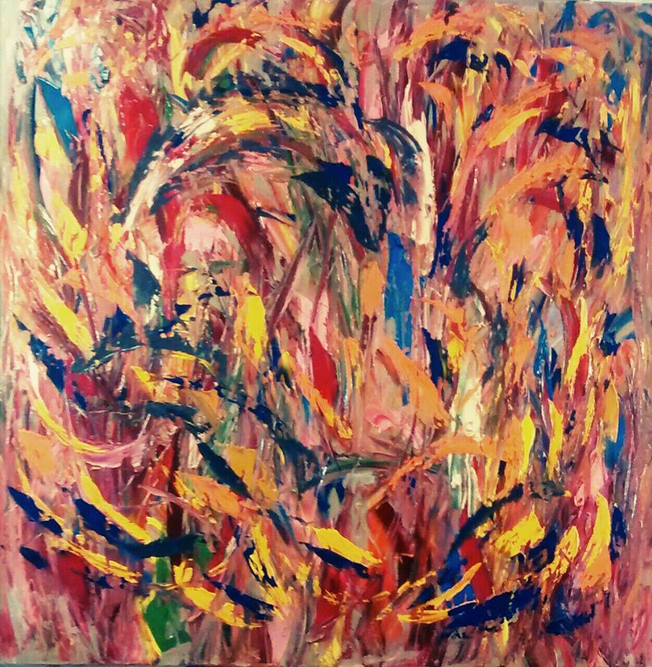
		</a>
		

			

				<header class="major">
					<h3>Wild flowers fighting with the eagles.</h3>
				</header>
        
Oil on canvas

        
48 x 48"

				<!-- <ul class="actions">
					<li><a href="gallery.html" class="button">Learn more</a></li>
				</ul> -->
			

		

	</section>

  <section>
		<a href="gallery.html" class="image">
			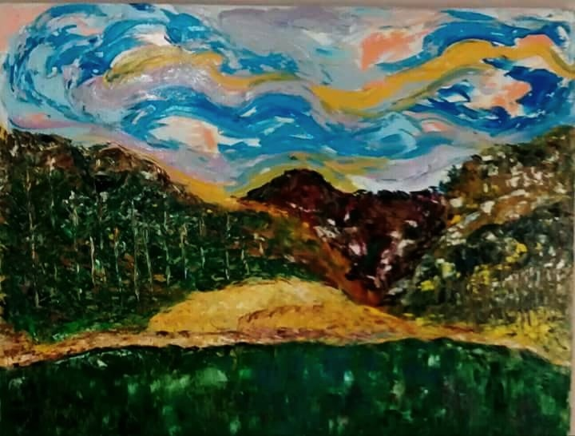
		</a>
		

			

				<header class="major">
					<h3>Early Morning</h3>
				</header>
        
Oil on canvas

        
36 x 48"

				<!-- <ul class="actions">
					<li><a href="gallery.html" class="button">Learn more</a></li>
				</ul> -->
			

		

	</section>

  <section>
		<a href="gallery.html" class="image">
			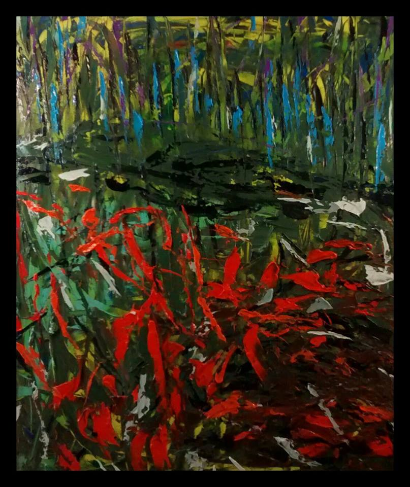
		</a>
		

			

				<header class="major">
					<h3>The Forest</h3>
				</header>
        
Oil on canvas

        
60 x 40"

				<!-- <ul class="actions">
					<li><a href="gallery.html" class="button">Learn more</a></li>
				</ul> -->
			

		

	</section>

  <section>
		<a href="gallery.html" class="image">
			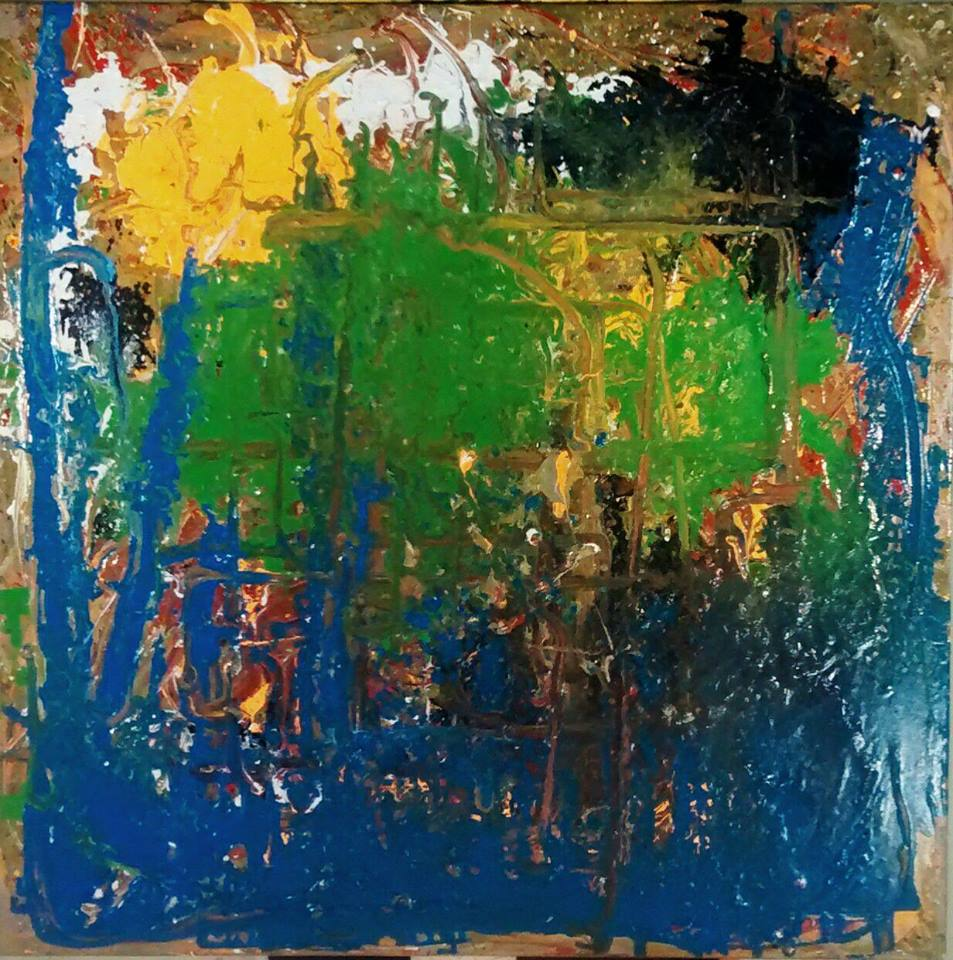
		</a>
		

			

				<header class="major">
					<h3>Blue landscape</h3>
				</header>
        
Oil on canvas

        
36 x 36"

				<!-- <ul class="actions">
					<li><a href="gallery.html" class="button">Learn more</a></li>
				</ul> -->
			

		

	</section>

  <section>
		<a href="gallery.html" class="image">
			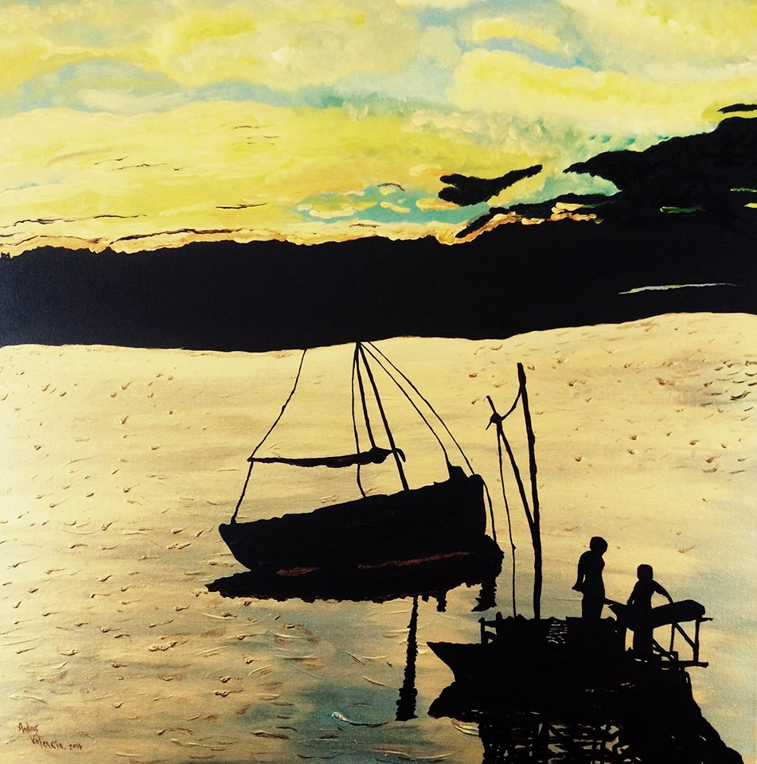
		</a>
		

			

				<header class="major">
					<h3>Golden beach at sunset </h3>
				</header>
        
Oil on canvas

        
24 x 24"

				<!-- <ul class="actions">
					<li><a href="gallery.html" class="button">Learn more</a></li>
				</ul> -->
			

		

	</section>

  <section>
		<a href="gallery.html" class="image">
			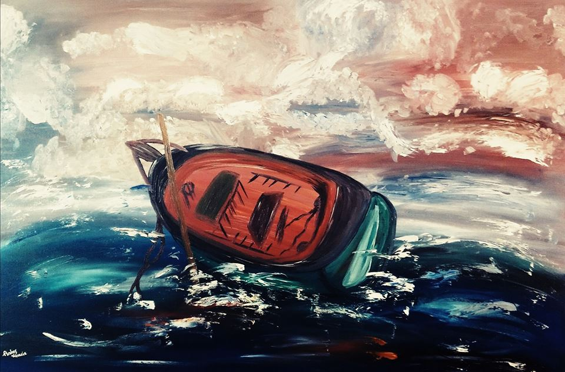
		</a>
		

			

				<header class="major">
					<h3>Turbulence</h3>
				</header>
        
Oil on canvas

        
24 x 36"

				<!-- <ul class="actions">
					<li><a href="gallery.html" class="button">Learn more</a></li>
				</ul> -->
			

		

	</section>

  <section>
		<a href="gallery.html" class="image">
			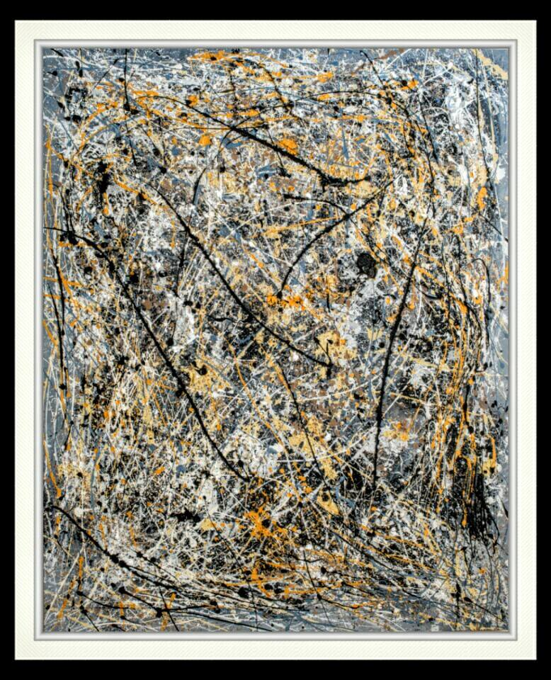
		</a>
		

			

				<header class="major">
					<h3>Three bulls in the arena </h3>
				</header>
        
Oil on canvas

        
60 x 48"

				<!-- <ul class="actions">
					<li><a href="gallery.html" class="button">Learn more</a></li>
				</ul> -->
			

		

	</section>

  <section>
		<a href="gallery.html" class="image">
			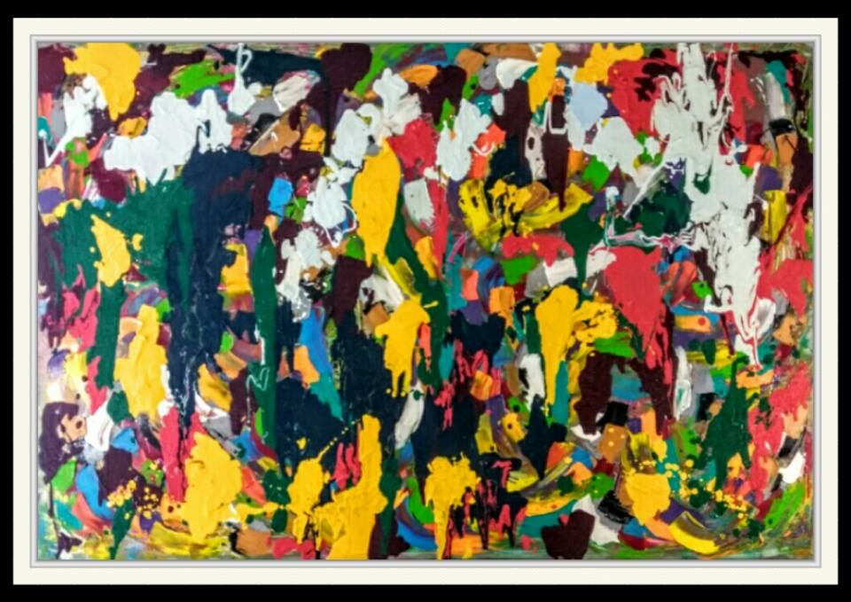
		</a>
		

			

				<header class="major">
					<h3>The Garden</h3>
				</header>
        
Oil on canvas

        
40 x 60"

				<!-- <ul class="actions">
					<li><a href="gallery.html" class="button">Learn more</a></li>
				</ul> -->
			

		

	</section>

</section>

<!-- Three -->
<section id="three">
	

		<header class="major">
			<h2>The Artist</h2>
		</header>
		
 <h4>Andres Valencia Zava</h4> I'm abstract painter originally from Colombia living in Toronto, ON. As an artist I'm fascinated with the beauty of color and layers of emotion.
    My art is my voice, thoughts and strong desires. My goal and part of my process is to recreate the color and brushstrokes I want to evoke in my paintings.
    Although I work primarily in abstract I love also to capture the light and matter that remains in the nature.
    My work includes dynamic, strong bold strokes, marks, texture and spontaneity.
    Even though I have had art training I'm also a self- taught artist.
    By being an artist, I can finally get in touch with my feelings.

		<ul class="actions">
			<li><a href="#contact" class="button next">Contact me</a></li>
		</ul>
	

</section>

