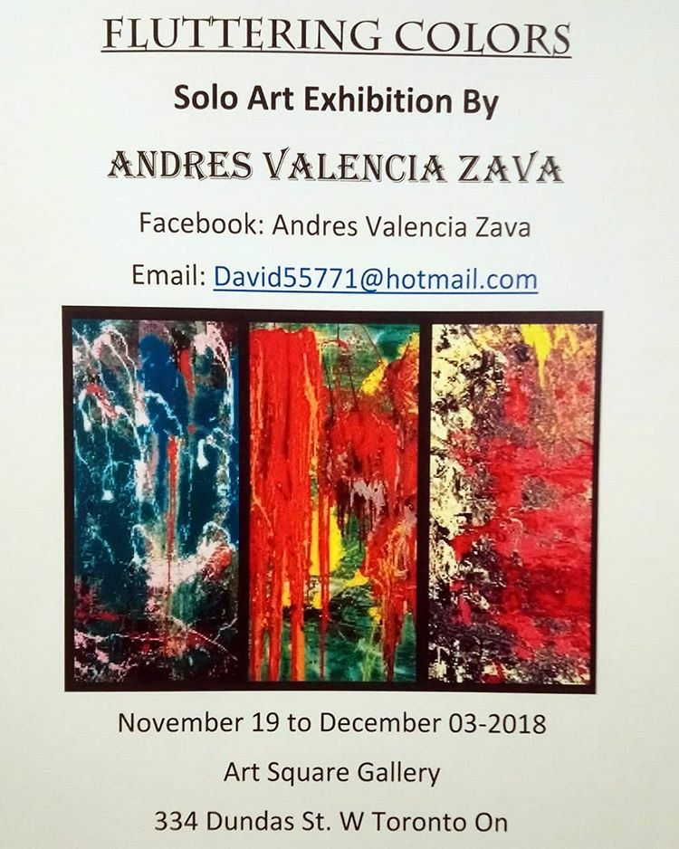

<!-- Main -->

<!-- One -->
<section id="one">
	

		<header class="major">
			<h2>News</h2>
			
The latest news

		</header>
		

	

</section>

<!-- Two -->
<section id="two" class="spotlights">

	<section>
		
		

			

				<header class="major">
					<h3>Fluttering Colors</h3>
				</header>
				
<strong>Solo Art Exhibition</strong> By <strong>Andres Valencia Zava</strong>
				 <a href="https://www.art-square.ca/galeery-underground/" target="_blank">
				Art Square Gallery</a> &emsp; - &emsp; 334 Dundas street west.
				 <strong>November 19 to December 03 - 2018.</strong>
				

				<ul class="actions">
					<li><a href="https://www.art-square.ca/" class="button">See more of the gallery</a></li>
				</ul>
			

		

	</section>

	<section>
		
		

			

				<header class="major">
					<h3>The Fluttering Colours exhibition</h3>
				</header>
				
Andres Valencia Zava will transform the colours, landscapes and objects of daily routine into colourful pieces of art in the exhibition Fluttering Colors.
				Influenced by Jean-Paul Riopelle and Joan Mitchell, this artist began to develop his own style in which feelings, streets, bridges and colour are his most important patterns when it comes to painting.
        

				<ul class="actions">
					<li><a href="http://latinosmag.com/la-exposicion-the-fluttering-colours/" class="button">Learn more</a></li>
				</ul>
			

		

	</section>

</section>

<!-- Three -->

