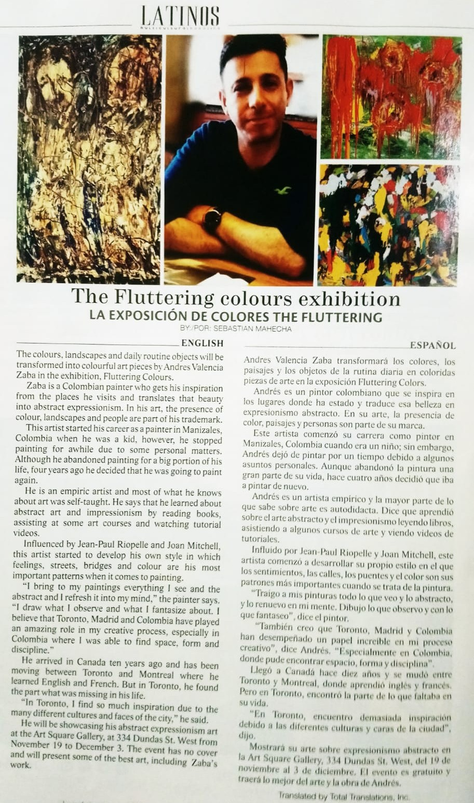

<!-- Main -->

<!-- One -->
<!-- <section id="one">
	

		<header class="major">
			<h2>News</h2>
		</header>
		

	

</section> -->

<!-- Two -->
<section id="two" class="spotlights">

	<section>
		
		

			

				<header class="major">
					<h3>La exposición The Fluttering Colours</h3>
				</header>
				
Andres Valencia Zava transformará los colores, los paisajes y los objetos de la rutina diaria en coloridas piezas de arte en la exposición Fluttering Colors. 
        Influido por Jean-Paul Riopelle y Joan Mitchell, este artista comenzó a desarrollar su propio estilo en el que los sentimientos, las calles, los puentes y el color son sus patrones más importantes cuando se trata de la pintura.
        

				<ul class="actions">
					<li><a href="http://latinosmag.com/la-exposicion-the-fluttering-colours/" class="button">Learn more</a></li>
				</ul>
			

		

	</section>

</section>

<!-- Three -->

